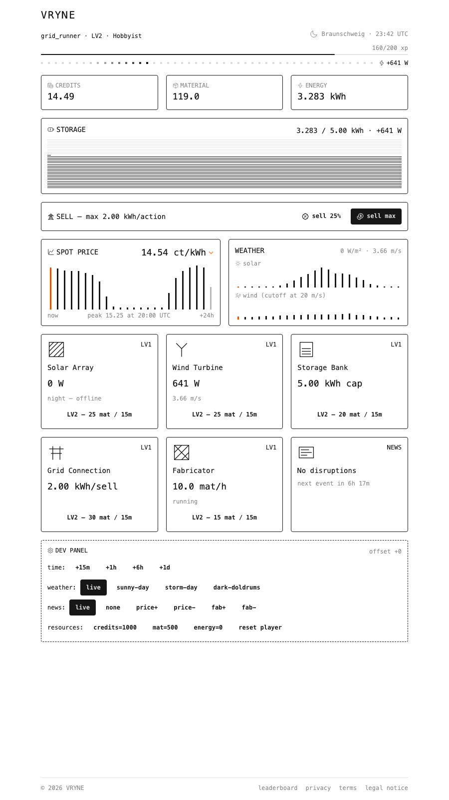
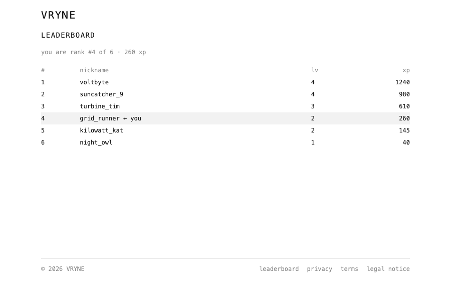
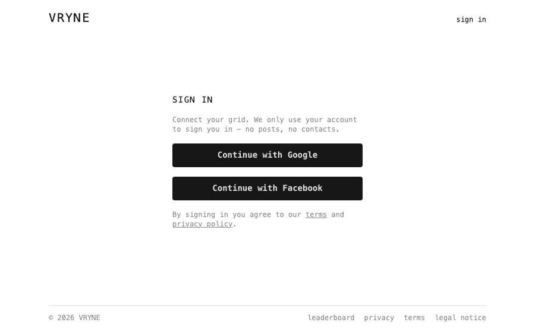

# Vryne

A cozy little idle game about running your own renewable energy grid — powered by **real weather** and **real electricity prices**.

You own a tiny patch of the grid: a solar array, a wind turbine, a storage bank, a grid connection and a fabricator. The sun and wind above your home region — you pick a place once during onboarding — decide how much you produce (fetched live from [Open-Meteo](https://open-meteo.com/)). The actual German day-ahead spot market (via [aWATTar](https://www.awattar.de/)) decides what your energy is worth. Sell smart, upgrade your buildings, earn XP and climb the leaderboard.

The whole simulation is _lazy_: nothing ticks while you're away. When you come back, the server settles everything you produced hour-by-hour since your last visit — so a night of good wind is a lovely morning surprise.



<p align="center">
  
  
</p>

## How it works

- **Real weather, your region** — at onboarding your home town is geocoded and snapped to a coarse ~150 km geohash cell, so nearby players share one region (and its weather cache) and no exact location is ever stored. Hourly solar radiation and wind speed come from Open-Meteo, with a synthetic fallback when the API is unavailable.
- **Real prices** — German day-ahead electricity prices from aWATTar. Selling at the evening peak simply pays more.
- **Lazy settlement** — production is integrated from your last visit to now as an hour-by-hour step function. No cron jobs, no background workers.
- **News events** — deterministic, seeded market/factory events every few hours. Headlines can optionally be written by an LLM (falls back to templates without an API key).
- **XP & leaderboard** — earn XP by selling energy and finishing upgrades, level up from _Tinkerer_ onwards, and see where you stand.

## Tech stack

[SvelteKit](https://svelte.dev/docs/kit) (remote functions, async SSR) · [Svelte 5](https://svelte.dev/) runes · [Tailwind CSS 4](https://tailwindcss.com/) + [daisyUI 5](https://daisyui.com/) · [Prisma 7](https://www.prisma.io/) on PostgreSQL · [better-auth](https://better-auth.com/) (social login only) · [Bun](https://bun.sh/) · [Vitest](https://vitest.dev/)

## Getting started

You'll need [Bun](https://bun.sh/) and a PostgreSQL database (a free [Prisma Postgres](https://www.prisma.io/postgres) instance works great).

```sh
# 1. Install dependencies
bun install

# 2. Configure your environment
cp .env.example .env
# fill in DATABASE_URL, then generate a secret:
openssl rand -base64 32   # → BETTER_AUTH_SECRET

# 3. Set up the database
bunx prisma migrate deploy
bun run db:seed           # seeds the fallback region (used by dev tooling)

# 4. Run it
bun run dev
```

> [!IMPORTANT]
> The dev script runs on the default port **5173** with `--strictPort`, so it always matches `BETTER_AUTH_URL` in your `.env` — the auth endpoints only work on that exact origin. If the port is taken, the server exits instead of silently shifting; free it and try again.

Open http://localhost:5173, sign in, pick a nickname and your home town — and your grid is created.

### Social logins

Vryne only uses social sign-in (no passwords to leak). Create OAuth credentials and drop them into `.env`:

| Provider | Console                                                                   | Redirect URI                                   |
| -------- | ------------------------------------------------------------------------- | ---------------------------------------------- |
| Google   | [Google Cloud Console](https://console.cloud.google.com/apis/credentials) | `{BETTER_AUTH_URL}/api/auth/callback/google`   |
| Facebook | [Meta for Developers](https://developers.facebook.com/apps/)              | `{BETTER_AUTH_URL}/api/auth/callback/facebook` |

**No OAuth credentials handy?** For local development you can forge a test session:

```sh
bun run scripts/dev-session.ts
```

It creates a test user and prints a `better-auth.session_token` cookie you can paste into your browser's dev tools.

## Scripts

| Command                      | What it does                                        |
| ---------------------------- | --------------------------------------------------- |
| `bun run dev`                | Dev server on port 5173 (matches `BETTER_AUTH_URL`) |
| `bun run build` / `preview`  | Production build / preview                          |
| `bun run check`              | Type-check with svelte-check                        |
| `bun run test`               | Unit tests (Vitest)                                 |
| `bun run lint` / `format`    | Prettier + ESLint                                   |
| `bun run db:seed`            | Seed the fallback region                            |
| `bunx prisma migrate deploy` | Apply pending migrations                            |

## Deployment (Railway)

The repo ships with a [railway.json](railway.json) — deploying to [Railway](https://railway.com/) is mostly point-and-click:

1. Create a new Railway project from this GitHub repo. Railpack detects Bun automatically.
2. Add a **PostgreSQL** database to the project (or bring your own, e.g. Prisma Postgres).
3. Set the service variables:

   | Variable                                    | Value                                                        |
   | ------------------------------------------- | ------------------------------------------------------------ |
   | `DATABASE_URL`                              | `${{Postgres.DATABASE_URL}}` (Railway reference) or your own |
   | `BETTER_AUTH_SECRET`                        | `openssl rand -base64 32`                                    |
   | `BETTER_AUTH_URL`                           | `https://<your-app>.up.railway.app`                          |
   | `ORIGIN`                                    | same as `BETTER_AUTH_URL` (required by adapter-node)         |
   | `GOOGLE_CLIENT_ID` / `GOOGLE_CLIENT_SECRET` | your OAuth credentials                                       |

4. Register the production redirect URIs with your OAuth providers, e.g. `https://<your-app>.up.railway.app/api/auth/callback/google`.

Migrations run automatically before each deploy (`preDeployCommand: bunx prisma migrate deploy`); the app starts via `bun run start` (SvelteKit adapter-node honors Railway's `PORT`).

## Project layout

```
src/lib/game/          Pure game logic (production, prices, news, XP) — fully unit-tested
src/lib/game/server/   Server-only services: settlement, weather & price fetching, game time
src/lib/remotes/       SvelteKit remote functions (account, leaderboard)
src/lib/components/    UI components (game panels, elements, layout)
src/routes/(app)/      The game — requires sign-in + nickname/location
src/routes/(content)/  Privacy, terms, legal (markdown pages)
prisma/                Schema, migrations, seed
```

The core game math lives in pure modules with no framework imports, so it's easy to test and reason about — `bun run test` runs the unit tests covering production settlement, geohash regions and news scheduling.

## Contributing

Contributions are very welcome — whether it's a bug report, a balancing idea, a new building, or a typo fix. This is a hobby-sized codebase and a friendly place to make your first open-source contribution.

1. Fork & clone, then follow _Getting started_ above.
2. Make your change. Keep game logic pure where possible and add a test if you touch the math.
3. Run `bun run check && bun run test && bun run lint` before opening a PR.

If you're unsure whether an idea fits, just open an issue and let's chat about it.

## License

[MIT](LICENSE) — do whatever makes you happy, just keep the notice.
